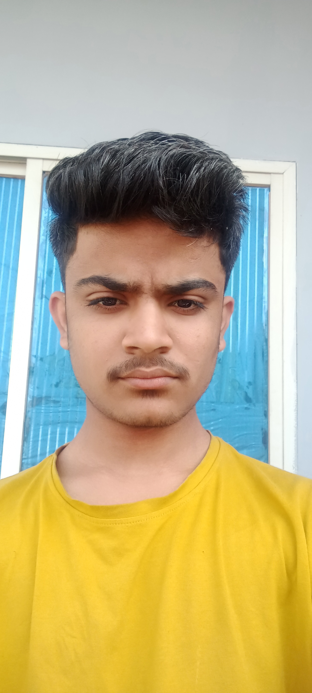

# Selfie Timelapse Project

This project aligns a sequence of daily selfies to a reference image and generates a smooth timelapse video.

## Features
- **Dense Face Normalization**: Uses MediaPipe Face Mesh (468 landmarks) to align faces perfectly.
- **Background Preservation**: Back-projects the reference frame to warp the full image, filling gaps with white.
- **Timelapse Generation**: Compiles the aligned images into a video.

### Alignment Example

| Reference Image | Input Image (Raw) | Aligned Image |
| :---: | :---: | :---: |
|  |  |  |
| *Target face alignment* | *Original daily selfie* | *Normalized & warped result* |

## Usage

### 1. Alignment
Place your input images in the `input_images/` folder and a reference image as `reference.png`.

Run the alignment script:
```bash
python selfie_alignement.py
```
This will generate aligned images in the `aligned/` directory.

### 2. Create Timelapse
Run the timelapse script to generate the video:
```bash
python create_timelapse.py
```

## Result

[Watch the Timelapse Video](./02_Jan_2023_to_08_Feb_2026.mp4)

> **Note**: To embed a playable video in a GitHub README, you typically need to drag and drop the video file into a GitHub issue or comment editor, which uploads it to GitHub's assets, and then paste the generated link here. Standard markdown links (like above) will allow users to download or view the raw file.
